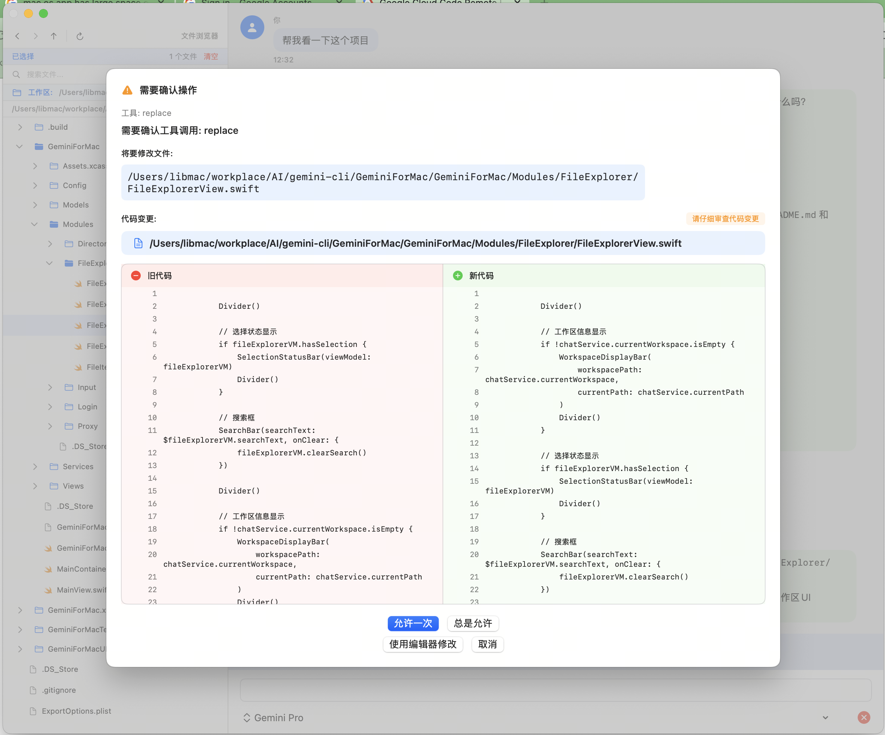
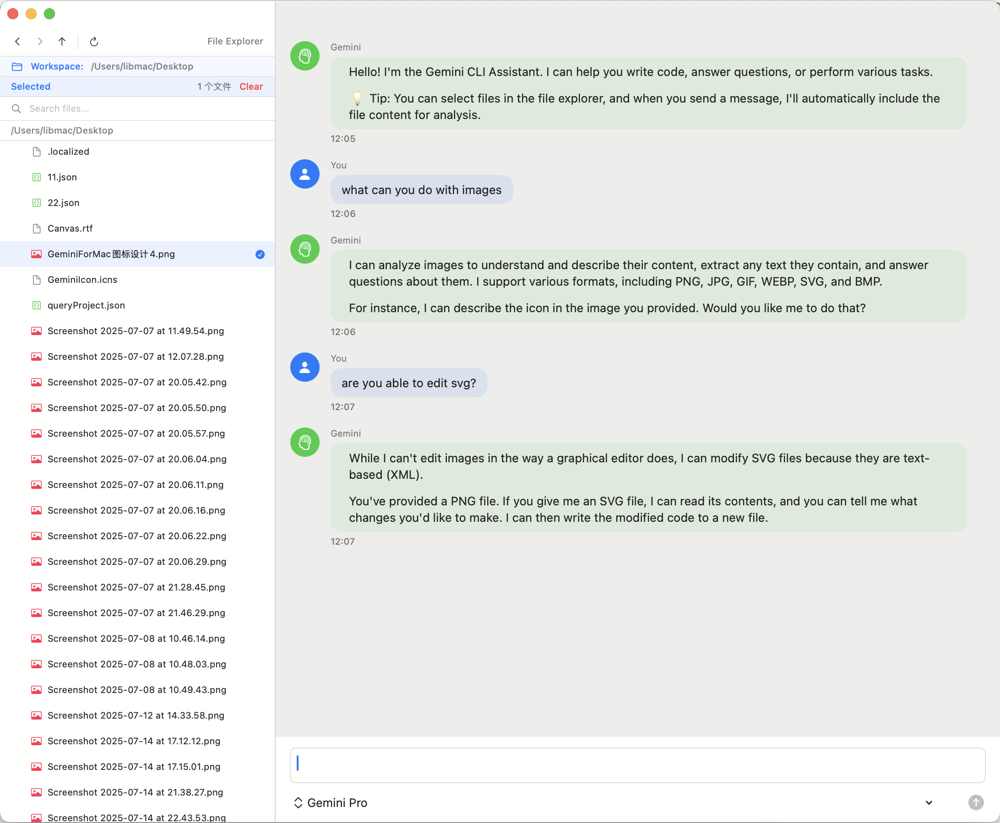

# GeminiForMac

GeminiForMac is a macOS desktop client based on [gemini-cli](./README_ORIGINAL.md), providing a user-friendly graphical interface for interacting with Google Gemini AI.

## Features


- **Intuitive GUI**: Modern native macOS interface design
- **File Management**: Built-in file browser for easy project file management
- **Proxy Support**: Built-in proxy settings with network proxy configuration
- **Project Management**: Support for switching and managing multiple projects

## Interface Overview


The application includes the following main interfaces:
- **Chat Interface**: Main conversation interaction area with Markdown rendering support
- **File Explorer**: Left sidebar file tree for browsing and selecting project files
- **Settings Panel**: Proxy settings, project configuration, etc.
- **Login Interface**: Support for Google account login and API Key configuration

## Installation and Usage

### System Requirements

- macOS 14.0 or higher
- Network connection (for AI services)

### Installation Steps

1. Download and install the PKG installer
2. Double-click the PKG file to install
3. Launch the GeminiForMac application
4. Server will start automatically (handled by postinstall script)
5. Follow the interface prompts to complete login and configuration

### Proxy Settings

If you need to use a proxy to access the network:

1. Open "Proxy Settings" in the application
2. Configure proxy server address and port
3. Save settings and restart the service

The system will automatically detect `http://127.0.0.1:7890` proxy by default.

## Development and Packaging

### Building the Application

```bash
# Navigate to the iOS/macOS project directory
cd GeminiForMac

# Build using Xcode
xcodebuild build -project GeminiForMac.xcodeproj -scheme GeminiForMac -configuration Release
```

### Creating Installer Package

```bash
# Run the packaging script
./macPackage/scripts/package-macos-pkg.sh
```

After packaging is complete, the PKG file will be generated in the `macPackage/dist/` directory.

### Viewing Logs

Application logs are stored in the following locations:

- **Application Logs**: `~/Library/Logs/GeminiForMac/`
- **Server Logs**: `~/Library/Logs/GeminiForMac/gemini-server.log`
- **Error Logs**: `~/Library/Logs/GeminiForMac/gemini-server-error.log`

```bash
# View real-time logs
tail -f ~/Library/Logs/GeminiForMac/gemini-server.log

# View error logs
tail -f ~/Library/Logs/GeminiForMac/gemini-server-error.log
```

### Restarting the Server

```bash
# Stop service
launchctl unload ~/Library/LaunchAgents/com.gemini.cli.server.plist

# Start service
launchctl load ~/Library/LaunchAgents/com.gemini.cli.server.plist

# Check service status
launchctl list | grep com.gemini.cli.server

# Verify service port
curl http://localhost:18080/health
```

## Uninstallation

### Complete Uninstallation Steps

1. **Stop background service**:
   ```bash
   launchctl unload ~/Library/LaunchAgents/com.gemini.cli.server.plist
   ```

2. **Delete application**:
   ```bash
   rm -rf /Applications/GeminiForMac.app
   ```

3. **Clean user data**:
   ```bash
   # Delete server files
   rm -rf ~/.gemini-server
   
   # Delete Launch Agent configuration
   rm -f ~/Library/LaunchAgents/com.gemini.cli.server.plist
   
   # Delete log files
   rm -rf ~/Library/Logs/GeminiForMac
   ```

4. **Clean configuration files** (optional):
   ```bash
   # Delete application configuration (if complete cleanup needed)
   rm -rf ~/Library/Preferences/com.gemini.cli.*
   rm -rf ~/Library/Application\ Support/GeminiForMac
   ```

## System Architecture

### Overall Architecture

```
┌─────────────────┐    HTTP/WebSocket     ┌─────────────────┐
│                 │ ──────────────────→   │                 │
│  macOS Client   │                       │ Background      │
│  (SwiftUI)      │ ←────────────────── │ Server (Node.js)│
│                 │                       │                 │
└─────────────────┘                       └─────────────────┘
         │                                         │
         │                                         │
    ┌────▼────┐                               ┌────▼────┐
    │ Local UI│                               │ Gemini  │
    │Components│                              │  API    │
    └─────────┘                               └─────────┘
```

### Core Components

#### 1. macOS Client (`GeminiForMac/`)

Native macOS application built with SwiftUI:

- **Main Modules**:
  - `MainView.swift`: Main interface container
  - `Modules/Input/`: Input components with dynamic height adjustment
  - `Modules/FileExplorer/`: File browser
  - `Modules/Login/`: Login and authentication
  - `Modules/Proxy/`: Proxy settings
  - `Services/`: Network services and data management

#### 2. Background Server (`packages/core/src/server/`)

Node.js background service providing API endpoints:

- **Core Services**:
  - `core/GeminiService.ts`: Gemini API integration
  - `auth/AuthService.ts`: Authentication management
  - `chat/ChatHandler.ts`: Chat processing
  - `files/FileService.ts`: File operations
  - `project/ProjectService.ts`: Project management
  - `utils/ProxyConfigManager.ts`: Proxy configuration

#### 3. Communication Protocol

- **HTTP API**: Standard REST interfaces for basic operations
- **WebSocket**: For real-time chat and streaming responses
- **Port**: Uses port `18080` by default

#### 4. Data Flow

1. User inputs message in macOS client
2. Client sends to background server via HTTP/WebSocket
3. Server calls Gemini API to process request
4. Response streams back to client via WebSocket
5. Client renders response content in real-time

### Configuration Management

- **Server Configuration**: `~/.gemini-server/` directory
- **Launch Agent**: `~/Library/LaunchAgents/com.gemini.cli.server.plist`
- **Proxy Configuration**: Auto-detection or manual configuration

## Troubleshooting

### Common Issues

1. **Server fails to start**:
   - Check if port 18080 is occupied
   - View error logs: `~/Library/Logs/GeminiForMac/gemini-server-error.log`

2. **Cannot connect to Gemini API**:
   - Check network connection
   - Verify proxy settings are correct
   - Validate API Key or login status

3. **Interface anomalies**:
   - Restart the application
   - Check macOS version compatibility

### Getting Help

- View original project documentation: [README_ORIGINAL.md](./README_ORIGINAL.md)
- Check log files for detailed error information
- Restart server service

## License

This project is based on the original gemini-cli project. Please refer to the relevant license terms.
