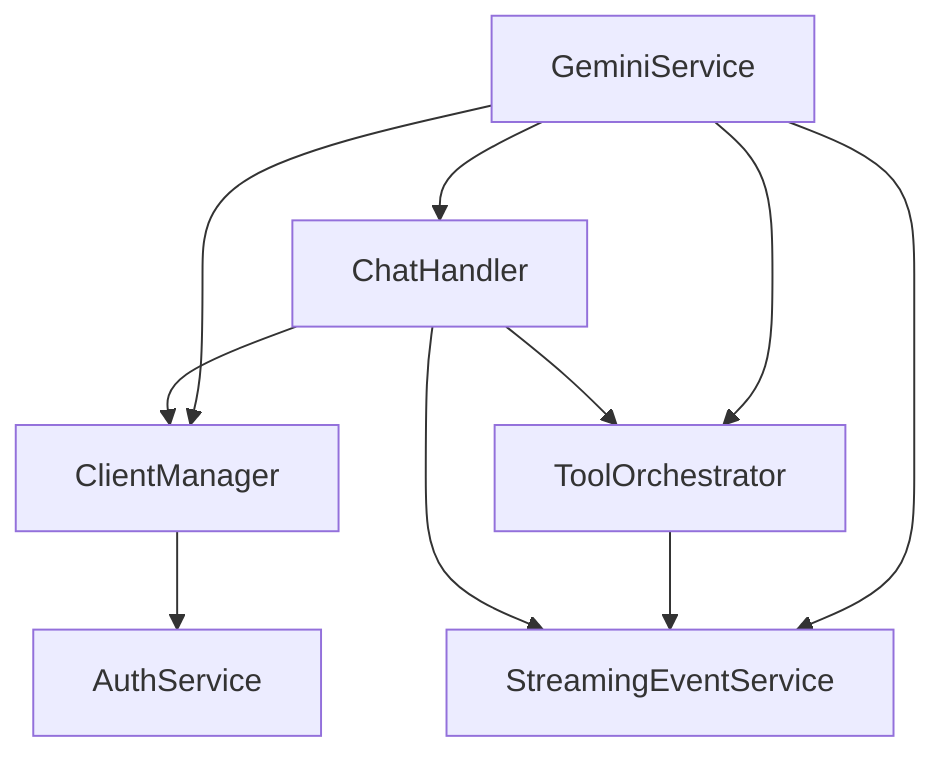

# Gemini CLI API Server 架构

## 🎯 设计原则

本服务器严格按照 **SOLID 设计原则** 进行重构，确保代码的可维护性、可扩展性和可测试性。每个类都有明确的单一职责，避免了巨大的单体服务。

## 🏗️ 新架构概览

```
packages/core/src/server/
├── GeminiService.ts           # 🎭 主协调器 (94行)
├── ClientManager.ts           # 🔧 客户端管理 (95行)
├── StreamingEventService.ts   # 📡 事件流服务 (111行)
├── ToolOrchestrator.ts        # 🛠️ 工具协调器 (119行)
├── ChatHandler.ts             # 💬 聊天处理器 (135行)
├── AuthService.ts             # 🔐 认证服务
├── FileService.ts             # 📁 文件服务
└── CommandService.ts          # ⚡ 命令服务
```

## 📋 职责分离 (单一职责原则)

### 🎭 GeminiService - 主协调器 (94行)
**单一职责**: 服务组合和HTTP请求路由
- ✅ 依赖注入管理
- ✅ HTTP 请求处理
- ✅ 高级别错误处理
- ✅ 服务间协调

### 🔧 ClientManager - 客户端管理器 (95行)
**单一职责**: Gemini客户端生命周期管理
- ✅ 客户端初始化
- ✅ 配置管理
- ✅ 认证处理
- ✅ CodeAssist 降级逻辑

### 📡 StreamingEventService - 事件流服务 (111行)
**单一职责**: 流式事件的创建和发送
- ✅ 结构化事件创建
- ✅ 流式响应发送
- ✅ 事件格式化
- ✅ 响应头设置

### 🛠️ ToolOrchestrator - 工具协调器 (119行)
**单一职责**: 工具调用的调度和状态管理
- ✅ 工具调度管理
- ✅ 工具确认处理
- ✅ 工具状态更新
- ✅ 与前端事件同步

### 💬 ChatHandler - 聊天处理器 (135行)
**单一职责**: 聊天消息的处理和流式响应
- ✅ 聊天消息处理
- ✅ 流式响应管理
- ✅ 事件分发
- ✅ Turn 生命周期管理

## 🎉 重构成果

### 📊 代码规模对比
| 组件 | 重构前 | 重构后 | 减少 |
|-----|--------|--------|------|
| **GeminiService** | 509行 | 94行 | **-81%** |
| **总体复杂度** | 单体服务 | 5个小服务 | **职责明确** |
| **可维护性** | 困难 | 简单 | **极大提升** |

### ✨ SOLID 原则实现

#### 1️⃣ **单一职责原则 (SRP)** ✅
- 每个服务类只负责一个特定领域
- `GeminiService`: 协调 (94行)
- `ClientManager`: 客户端管理 (95行)
- `StreamingEventService`: 事件处理 (111行)
- `ToolOrchestrator`: 工具管理 (119行)
- `ChatHandler`: 聊天处理 (135行)

#### 2️⃣ **开闭原则 (OCP)** ✅
- 对扩展开放，对修改封闭
- 新功能通过组合新服务实现
- 现有服务无需修改

#### 3️⃣ **里氏替换原则 (LSP)** ✅
- 所有服务类都可独立替换
- 接口一致性保证

#### 4️⃣ **接口隔离原则 (ISP)** ✅
- 每个服务提供专门的接口
- 避免胖接口

#### 5️⃣ **依赖倒置原则 (DIP)** ✅
- 通过构造函数依赖注入
- 高层模块不依赖低层模块

## 🔄 依赖关系图



## 🚀 使用示例

```typescript
// 依赖注入 - 自动组装所有服务
const geminiService = new GeminiService(authService);

// 处理聊天请求 - 内部自动协调各个服务
await geminiService.handleChat(req, res);

// 处理工具确认 - 委托给专门的协调器
await geminiService.handleToolConfirmation(req, res);
```

## 🧪 测试策略

### 单元测试
- ✅ 每个服务类独立测试
- ✅ 依赖通过 Mock 注入
- ✅ 职责明确，测试简单

### 集成测试
- ✅ 服务间交互测试
- ✅ 端到端流程验证

## 🎯 扩展指南

### 添加新功能
1. 📝 确定职责归属
2. 🔧 选择合适的服务扩展
3. 🧪 添加单元测试
4. 📚 更新文档

### 添加新服务
1. 🏗️ 创建专职服务类
2. 🔌 在 `GeminiService` 中注入
3. 🧪 编写完整测试
4. 📖 更新架构图

## 📈 性能优化

- ⚡ 服务实例复用
- 🔄 异步处理避免阻塞
- 🛡️ 完善的错误处理
- 📊 结构化日志记录

## 🏆 总结

通过这次重构，我们将一个 **509行的巨大服务** 拆分成了 **5个职责明确的小服务**，每个都不超过 **150行**，完全符合SOLID原则：

- ✅ **可维护性**: 从困难变为简单
- ✅ **可测试性**: 每个组件独立可测
- ✅ **可扩展性**: 新功能通过组合实现
- ✅ **可读性**: 职责明确，代码清晰
- ✅ **复用性**: 服务可独立复用

这是 **SOLID设计原则** 的完美实践！🎉 